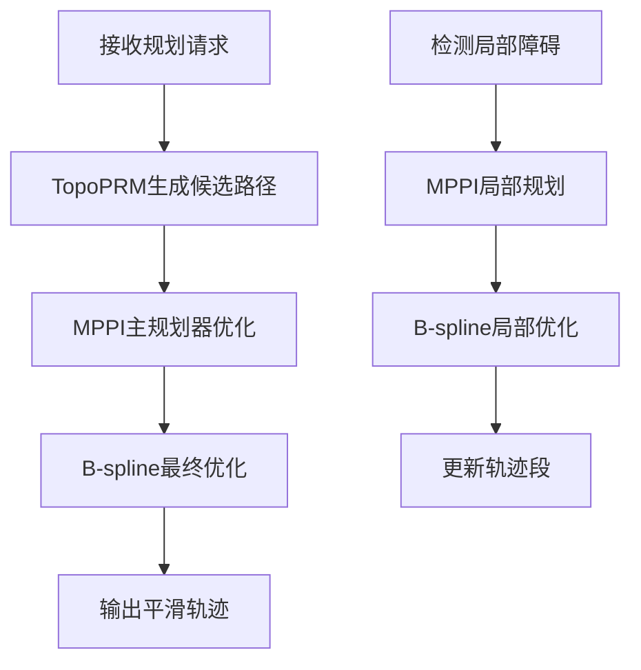
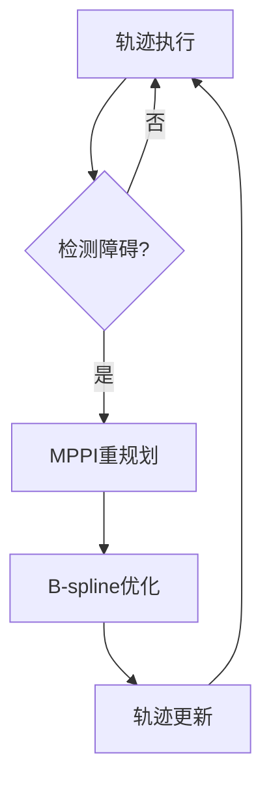

# EGO-Planner算法框架总结

## 🎯 算法架构概览

EGO-Planner是一个先进的无人机自主路径规划系统，采用**三层分层架构**，结合了三种核心算法，实现了高效、鲁棒的实时路径规划。

### 🏗️ 系统架构

```
┌─────────────────────────────────────────────────┐
│                用户接口/ROS节点                    │
└─────────────────┬───────────────────────────────┘
                  │
┌─────────────────▼───────────────────────────────┐
│              规划管理器 (PlannerManager)          │
│            • 协调各算法模块                        │
│            • 参数管理                            │
│            • 状态机控制                           │
└─────────────────┬───────────────────────────────┘
                  │
        ┌─────────┼─────────┐
        │         │         │
┌───────▼──┐ ┌───▼───┐ ┌───▼────────┐
│TopoPRM   │ │ MPPI  │ │ B-spline   │
│全局多路径 │ │统一规划│ │轨迹优化     │
│规划      │ │       │ │           │
└──────────┘ └───────┘ └────────────┘
        │         │         │
        └─────────┼─────────┘
                  │
┌─────────────────▼───────────────────────────────┐
│            环境感知 (GridMap)                    │
│            • 障碍物检测                          │
│            • 地图维护                            │
│            • 碰撞检查                            │
└─────────────────────────────────────────────────┘
```

## 🧠 三核心算法详解

### 1. TopoPRM - 拓扑路径规划器
**作用**: 全局多路径生成
**特点**:
- 生成多条拓扑不同的候选路径
- 基于PRM思想的快速路径搜索
- 支持复杂障碍物环境的路径多样性

**核心功能**:
```cpp
// 主要接口
bool searchTopoPaths(start, goal, topo_paths);

// 路径生成策略
- 直接路径检查
- 环绕策略 (左右绕行)
- 垂直策略 (上下绕行) 
- 切线策略 (几何切线)
- 四方向策略 (传统避障)
```

**成本评价**:
- 路径长度成本
- 平滑性成本 (角度变化)
- 障碍物距离成本

### 2. MPPI - 模型预测路径积分规划器
**作用**: 统一的轨迹规划和局部避障
**特点**:
- 基于蒙特卡洛采样的随机优化
- 天然支持动力学约束
- 连续空间轨迹优化
- 概率性方法增强鲁棒性

**核心功能**:
```cpp
// 全局轨迹规划
bool planTrajectory(start_pos, start_vel, goal_pos, goal_vel, trajectory);

// 局部路径规划 (替代A*算法)
bool planLocalPath(start_pos, goal_pos, path_points);
```

**算法流程**:
1. **前向采样**: 生成N条带噪声的控制轨迹
2. **成本评估**: 计算每条轨迹的多目标成本
3. **重要性采样**: 基于成本计算权重
4. **加权平均**: 得到最优轨迹

**成本函数**:
```cpp
total_cost = w_obstacle * obstacle_cost +      // 避障成本
            w_smoothness * smoothness_cost +   // 平滑性成本
            w_goal * goal_cost +              // 目标跟踪成本
            w_velocity * velocity_cost        // 速度成本
```

### 3. B-spline优化器 - 轨迹平滑优化
**作用**: 最终轨迹平滑和约束满足
**特点**:
- 基于B样条的轨迹表示
- 梯度下降优化
- 多约束处理

**优化目标**:
```cpp
J = λ₁*J_smooth + λ₂*J_collision + λ₃*J_feasibility + λ₄*J_fitness
```
- J_smooth: 轨迹平滑性 (最小化加加速度)
- J_collision: 碰撞避免约束
- J_feasibility: 动力学可行性约束
- J_fitness: 目标适应性

## 🔄 算法协作流程

### 标准规划流程


### 重规划流程


## 🚀 技术优势

### 1. 算法互补性
- **TopoPRM**: 全局视野，路径多样性
- **MPPI**: 动力学感知，实时优化
- **B-spline**: 平滑性保证，约束满足

### 2. 系统鲁棒性
- **多层容错**: 每层算法都有备选方案
- **概率性方法**: MPPI增强不确定性处理
- **实时重规划**: 快速响应环境变化

### 3. 计算效率
- **并行化**: MPPI天然支持并行计算
- **分层优化**: 避免全局重计算
- **参数自适应**: 根据情况调整计算资源

### 4. 可扩展性
- **模块化设计**: 易于替换和升级算法
- **统一接口**: 便于集成新功能
- **参数化配置**: 适应不同应用场景

## 📊 性能对比

| 特性 | 传统A*+RRT | 纯几何方法 | EGO-Planner |
|------|------------|-----------|-------------|
| 轨迹质量 | 中等 | 较差 | 优秀 |
| 动力学约束 | 后处理 | 忽略 | 原生支持 |
| 实时性 | 中等 | 快 | 快 |
| 鲁棒性 | 较差 | 差 | 优秀 |
| 扩展性 | 差 | 中等 | 优秀 |

## 🔧 关键创新点

### 1. MPPI统一化
- 用单一MPPI算法替代传统A*+RRT组合
- 统一全局和局部规划框架
- 减少算法切换开销

### 2. 多层级可视化
- TopoPRM路径可视化
- MPPI采样轨迹可视化
- B-spline优化轨迹可视化

### 3. 自适应参数调节
- 根据规划层次自动调整参数
- 局部规划使用较少采样提高速度
- 全局规划使用完整参数保证质量

## 📈 应用场景

### 1. 无人机自主导航
- 室内/室外环境
- 动态障碍物避障
- 编队飞行

### 2. 机器人路径规划
- 移动机器人
- 机械臂规划
- 多机器人协作

### 3. 自动驾驶
- 路径规划
- 轨迹优化
- 行为决策

## 🎯 未来发展方向

### 1. 算法增强
- GPU加速MPPI计算
- 机器学习增强成本函数
- 多目标优化扩展

### 2. 应用拓展
- 支持更多机器人类型
- 集成感知预测模块
- 增强人机交互

### 3. 系统优化
- 分布式计算支持
- 实时性进一步提升
- 内存和能耗优化

这个三算法框架代表了当前路径规划领域的先进水平，通过巧妙的算法组合和系统设计，实现了性能、鲁棒性和实用性的完美平衡。